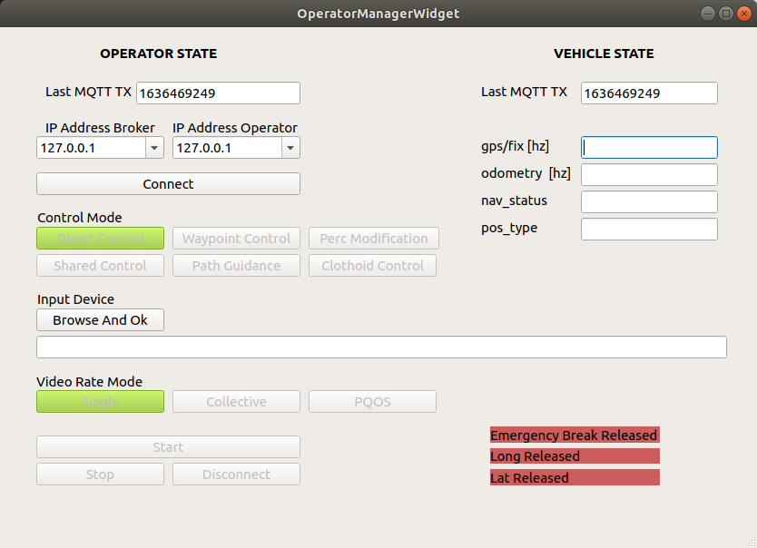
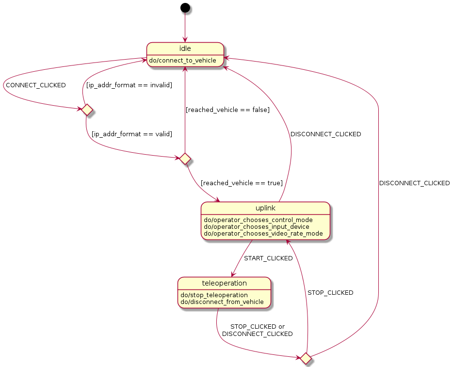

# tod_manager

This ROS package establishes the connection between an operator and a vehicle. There is a operator manager node and a vehicle manager node. They behave as counterparts and communicate the status message. The operator manager is superior to the vehicle manager and overwrites states at the vehicle side.

## Dependencies

* ROS Packages: see `package.xml`
* [Qt5](https://www.qt.io/) (Widgets Core Network Test)

  ```bash
  sudo apt-get install qt5-default -y
  ```

* [PahoMqttCpp](https://github.com/eclipse/paho.mqtt.cpp): Install instructions can be found in the [tod_network](https://github.com/TUMFTM/tod_common/tree/master/tod_network/) package.

## Documentation

### Operator Manager

The operator manager provides a GUI for the operator to initiate the connection to the vehicle. Furthermore, the operator is able to choose a control mode, an input device and a video rate mode. The status_msg is circulated between the Operator Manager and [VehicleManager](#vehicle-manager) using MQTT. The status_msg is continuously updated. The operator has different buttons to traverse the [State machine](#state-machine).

The labels `Emergency Break Released`, `Long Released` and `Lat Released` visualize the status of the in-vehicle safety switches respectively in red or green.



**Published Topics:**  

* `/Operator/Manager/status_msg` ([tod_msgs/StatusMsg](https://github.com/TUMFTM/tod_common/blob/master/tod_msgs/msg/Status.msg))

### Vehicle Manager

Reads the safety_driver_status, nav_status and pos_type from the vehicle. The status_msg is circulated between the Operator Manager and Vehicle Manager using MQTT. The status_msg is continuously updated.

**Published Topics:**

* `/Vehicle/Manager/status_msg` ([tod_msgs/StatusMsg](https://github.com/TUMFTM/tod_common/blob/master/tod_msgs/msg/Status.msg))

**Subscriptions:**

* `/Vehicle/VehicleBridge/safety_driver_status` ([tod_msgs/StatusMsg](https://github.com/TUMFTM/tod_common/blob/master/tod_msgs/msg/Status.msg))
* `/Vehicle/VehicleBridge/gps/nav_status` ([std_msgs/String](http://docs.ros.org/en/melodic/api/std_msgs/html/msg/String.html))
* `/Vehicle/VehicleBridge/gps/pos_type` ([std_msgs/String](http://docs.ros.org/en/melodic/api/std_msgs/html/msg/String.html))

## Quick start

```bash
caktin build tod_manager
source devel/setup.zsh
roslaunch tod_manager tod_manager.launch
```

## State Machine

The tod_manager can be modelled as a state machine with the following states


