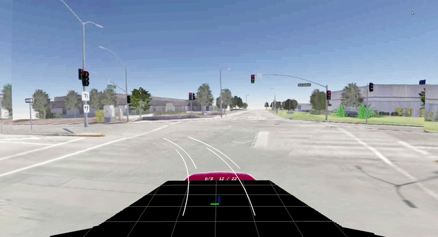
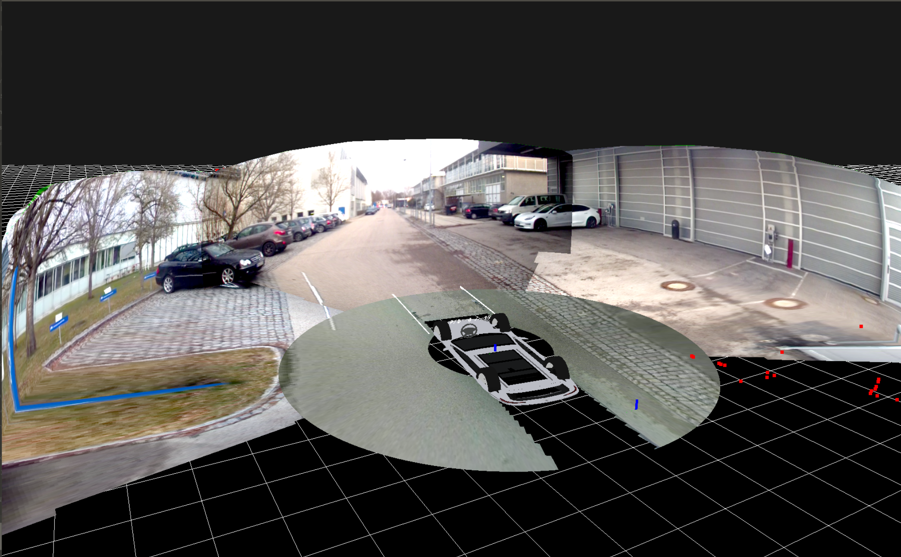
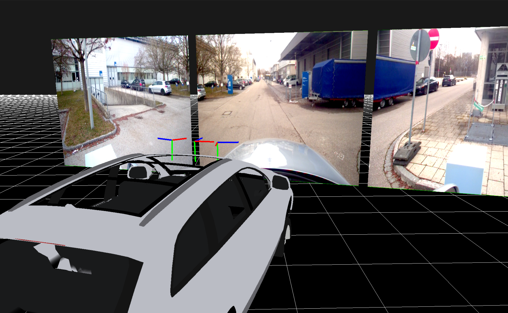

# tod_visual

The package provides a function-rich and flexible HMI for the operator to perform the teleoperation.
It displays received data from the Perception and Bridge packages in various ways.
A 3D world, comparable to the [rviz package](http://wiki.ros.org/rviz), is constructed using the OpenGL API. Inspired by the open
source [game engine Hazel](https://github.com/TheCherno/Hazel), this package uses the Entity Component System (ECS) design pattern through the
[entt library](https://skypjack.github.io/entt/), based on the composition over inheritance principle. There is also support for an HMD.
Snapshots of the HMI, exhibiting a view of the vehicle model and giving an impression of the projection of video streams
on either rectangles or a spherical canvas, can be seen in the examples below.

## Usage

It is possible to interact with the tod_visual and to change the camera perspective. The following key presses are used:
  * Arrow Up/Down/Left/Right: Circle around target point
  * Page Up/Down: Move target point up and down

## Dependencies
  * ROS Packages: see `package.xml`
  * Third Party:
    * assimp
    * GLM
    * glfw3 3.2
    * Freetype
    * yaml-cpp
    * OpenGL
    * OpenVR
    ```bash
    sudo apt-get install libassimp-dev -y
    sudo apt-get install libglm-dev -y
    sudo apt-get install libglfw3-dev -y
    sudo apt-get install libfreetype6-dev -y
    sudo apt-get install libyaml-cpp-dev -y
    # OpenGL
    sudo apt-get install build-essential libxmu-dev libxi-dev libgl-dev libosmesa-dev -y
    sudo apt-get install libglew-dev -y
    # OpenVR
    sudo add-apt-repository multiverse -y
    sudo apt-get install steam steam-devices libvulkan1 -y
    cd /tmp && git clone https://github.com/ValveSoftware/openvr.git openvr
    cd openvr && git checkout tags/v1.14.15
    mkdir build && cd build && cmake .. && make -j32
    sudo make install && sudo ldconfig
    cd /tmp && sudo rm -r openvr && cd
    ```

## Documentation

The HMI is constructed through a number of entities, listed in the following table.
| Entity Class | Description | Sample Usage (and Subscriptions) |
|---|---|---|
| Base Footprint | To render the position of vehicle. | Track the states of vehicle. (`/Operator/VehicleBridge/odometry`) |
| Camera | To render the camera perspective. | Creates an openGL camera that can be assigned to a framebuffer. |
| Coordinate System | To render a relative position of (data) objects in the scene. | Describe relative positions of data, e.g., a laser scan relative to the sensor. Used to transform positions in coordinate system of Base Footprint to coherently render the complete scene. |
| Display | To render alpha-numeric content (text). | Display various vehicle data such as desired/actual velocity, gear position, etc. (`/Operator/VehicleBridge/vehicle_data`, `/Operator/CommandCreation/primary_control_cmd`, `/Operator/CommandCreation/secondary_control_cmd`)|
| Floor | To render a virtual ground of the 3D world.| Introduce a virtual floor to improve interaction capabilities. |
| Grid | To render a grid of the 3D world. | Display a squared grid to improve spatial perception. |
| Laser Scan | To render 2D lidar scans. | Display point cloud data. (`/Operator/Lidar/*/scan`) |
| Object List | To render objects in the scene. | Can be used to visualize a topic of type tod_msgs::ObjectList. |
| Path | To render paths. | Display projected vehicle motion (`/Operator/Projection/vehicle_lane_front_*`) |
| Polygon | To render polygons in the scene. | Can be used to visualize a topic of type tod_msgs::ColoredPolygon. |
| Top View | To render rectangular display of scene, captured by another scene camera. | Display bird's eye view of scene. Usually useful for narrow corridor or parking maneuvers. |
| Video | To render videos on video canvas (Supported projection modes: `RECTANGULAR=0`, `SPHERE=1`, `HALF_SPHERE_WITH_GROUND_PLANE=2`, `GROUND_PLANE=3`, `ROBINSON=4` [unwrap sphere to flat surface]). | Display video streams. (`/Operator/Video/*/image_raw`) |

The HMI also detects key presses and mouse clicks, published under the following topics.
  * `/Operator/Visual/KeyPress` [[tod_msgs/KeyPress](https://github.com/TUMFTM/tod_common/blob/master/tod_msgs/msg/KeyPress.msg)]
  * `/Operator/Visual/MousePositionClick` [[geometry_msgs/Point](http://docs.ros.org/en/melodic/api/geometry_msgs/html/msg/Point.html)]

When launching the HMI with a given `vehicleID`, the data of some entities is partially serialized in `yaml/<vehicleID>.yaml`. This file can be modified before launching the HMI again.

## Demo

A rosbag for a playback demo has been recorded in the [SVL Driving Simulator](https://www.svlsimulator.com/). Execute the following steps to run the demo.
  * Clone the [container repository](https://github.com/TUMFTM/teleoperated_driving) and follow the steps under "Getting started" to build the workspace.
    For brevity, you can build `tod_visual`, only. See above, for the commands to install its third party dependencies.
    ```bash
    catkin build tod_visual
    ```
  * Download the rosbag from [here](https://mediatum.ub.tum.de/1636609?v=1) and place it under the following file path:
    `/home/$USER/Documents/ToD_Playback/lgsvl-for-visual.bag`.
  * From the sourced workspace, launch the demo.
    ```bash
    source devel/setup.bash # or `setup.zsh`, depending on your shell
    roslaunch tod_visual demo.launch
    ```
  * The `tod_visual` should open and playback the demo as shown below.
    

## Video Display Examples

Examples of the HMI with videos being displayed on a spherical video canvas or on rectangles.


